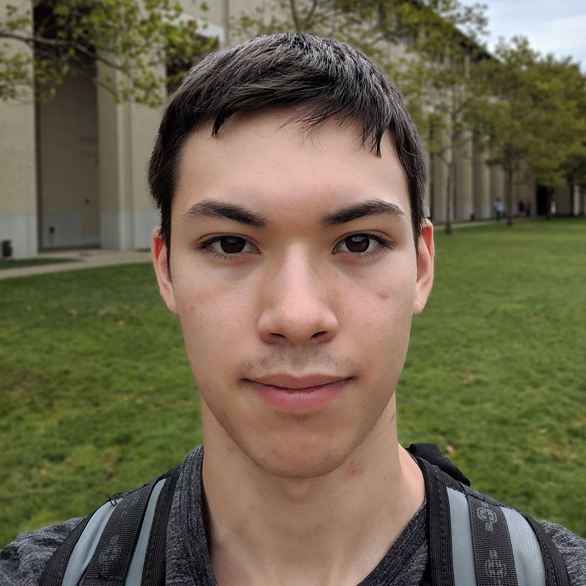

Hello, my name is Joseph Yankel. I am an Electrical and Computer Engineering
(ECE) student at Carnegie Mellon University.

  

    <h2>Contact</h2>
    <h3>Email:</h3>
    
jpyankel@gmail.com

    <h3>Phone:</h3>
    
724-993-0043

    <h3>Other:</h3>
    

      
      
    

  

  

    <h2>About Me</h2>
    

My first interest in technology began in my childhood: The perfect mix of Star
Wars, Nintendo, and electronics snap-kits as influences instilled in me a
desire to learn how to create my own futuristic robots and cool video games.
    

    

I began my foray into the world of software development through programming my
own video games at 10 years old. Eventually, my teenage self decided being a
video game developer was my dream job, and I spent time learning programming,
3D modeling, and music composition. Check out my
<a href="https://www.youtube.com/channel/UCSncSh-y0cKIZJ4V9vPt1RA">
YouTube channel</a>
to see some uploads of my early work.
    

    

When I started my journey as a student at Carnegie Mellon University, I soon
learned the amazing breadth the ECE field has to offer. My classes and
experiences at CMU converted me to a learner of all things ECE.
    

    

My current interests lie in embedded systems and electronics. My goal is to
eventually create devices to help people, whether the field be one in
biomedical, neurotechnology, or entertainment industries.
    

  

